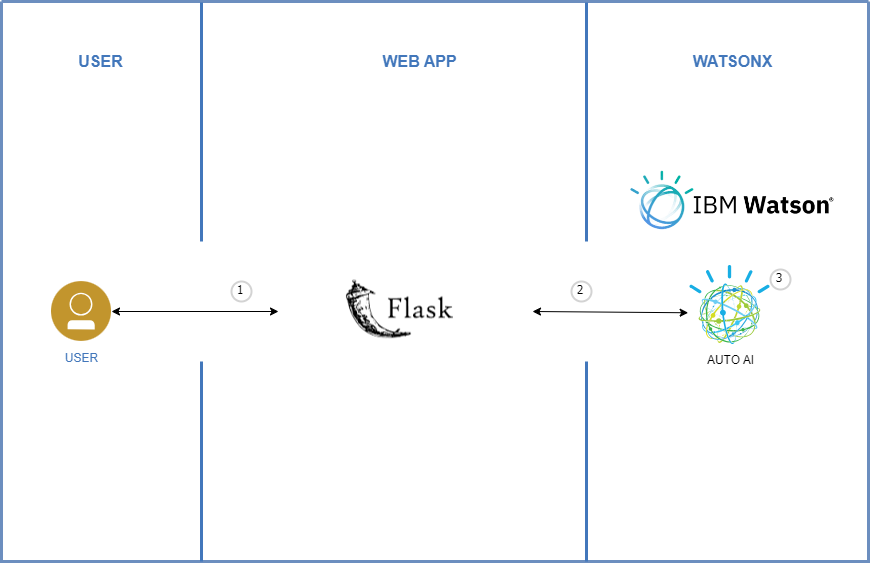
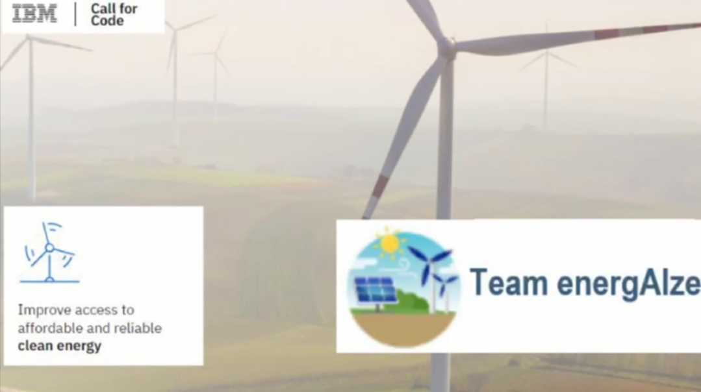
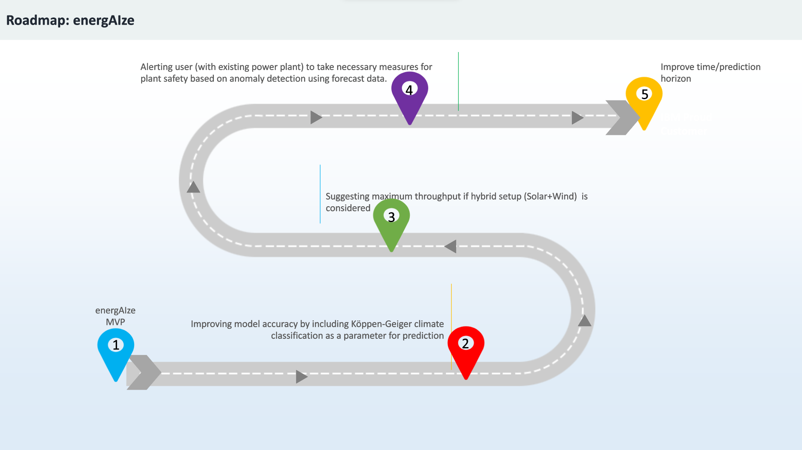

# EnergAIze

- [Project summary](#project-summary)
  - [The issue we are hoping to solve](#the-issue-we-are-hoping-to-solve)
  - [How our technology solution can help](#how-our-technology-solution-can-help)
  - [Our idea](#our-idea)
- [Technology implementation](#technology-implementation)
  - [IBM AI service(s) used](#ibm-ai-services-used)
  - [Other IBM technology used](#other-ibm-technology-used)
  - [Solution architecture](#solution-architecture)
- [Presentation materials](#presentation-materials)
  - [Solution demo video](#solution-demo-video)
  - [Project development roadmap](#project-development-roadmap)
- [Additional details](#additional-details)
  - [How to run the project](#how-to-run-the-project)
  - [Live demo](#live-demo)
- [About this template](#about-this-template)
  - [Contributing](#contributing)
  - [Versioning](#versioning)
  - [Authors](#authors)
  - [License](#license)
  - [Acknowledgments](#acknowledgments)

_INSTRUCTIONS: Complete all required deliverable sections below._

## Project summary

### The issue we are hoping to solve

With the intent to help government plan the improved access to affordable and reliable clean energy in areas which are deficit of electricity, we have developed EnergAIze. For a given location, the application will process and predict the suitable form of clean energy one can switch to based on historical data and forecast.

### How our technology solution can help

EnergAIze is an AI based solution that can help in better planning to improve access to clean energy

### Our idea

Renewable power often referred as Clean Energy is booming, as innovation brings down costs and starts to deliver on the promise of a clean energy future. Solar and wind generation are breaking records and being integrated into the national electricity grid without compromising reliability.
Now that we have innovative and less-expensive ways to capture and retain wind and solar energy, renewables are becoming a more important power source. 
AI technology can help reduce costs, improve efficiency, and optimize energy practices while producing clean energy.

Our solution can improve access to affordable and reliable clean energy by:

- Focusing on planning to setup the system by utilizing the availability of natural sources like wind and/or sunlight.

- It can predict the energy demand which can help in terms of sizing/capacity.

- Also, help predicting the future consumption and help optimizing power generation.

## Technology implementation

### IBM AI service(s) used

- [IBM WatsonX](https://cloud.ibm.com/watsonx/overview) - WatsonX Auto AI tool to train a Machine learning model on weather dataset.

### Other IBM technology used

- [IBM Cloud Object Storage](https://cloud.ibm.com/docs/cloud-object-storage?topic=cloud-object-storage-getting-started-cloud-object-storage) - IBM COS is used for storing dataset, trained model and other assets.

### Solution architecture

Diagram and step-by-step description of the flow of our solution:

1. The user navigates to the site and provide latitude, longitude, available land area and average energy consumption in watt.
2. Web App send the inputs to IBM WatsonX Auto AI for inference.
3. Auto AI infers the provided input and generates the prediction of next 15 days back.

## Presentation materials

### Solution demo video

### Project development roadmap

The project currently does the following things.

- Analyses historical weather data from last 3 years for given location
- Then for provided location, the application suggests the type of power plant to install
- Predicts the power generation output, By analyzing weather forcast of next 15 days.
- If there is surplus/deficit, that is, the difference of Avg consumption (approx) and Avg forcasted generation for 15 days.

Below is roadmap that shows how we plan to elevate our application with valuable additions.

### How to run the project

#### Data Source references
Use weather.com api for data source 
- [API - Standard - v3 - Forecast - Daily Forecast (3, 5, 7, 10, 15 Day)
](https://docs.google.com/document/d/1HiGun-m_NneSjmZGwDDEoG0gL9aKd1jaN0YC4jP6Eqs/edit)
- [Limited Availability - v3 - Forecast - Hourly Forecast - Enterprise - (6hour, 12hour), (1, 2, 3, 10, 15 Day)
](https://docs.google.com/document/d/1RY44O8ujbIA_tjlC4vYKHKzwSwEmNxuGw5sEJ9dYjG4/edit)
- [NSRDB: National Solar Radiation Database
](https://nsrdb.nrel.gov/data-viewer)

#### IBM WatsonX Auto AI
Follow [these](https://www.ibm.com/docs/en/cloud-paks/cp-data/4.7.x?topic=autoai-building-experiment) steps to build ML model using IBM WatsonX Auto AI.

#### Backend deployment
- [Follow Flask setup Readme](/Python-backend/Readme.md)

#### Frontend deployment
- [Follow React Frontend Readme](/Frontend/README.md)

### Live Demo
Due to resource constraints we could not deploy our application for public access. However, above steps can be used to do a local setup.
 

### Authors

### License

This project is licensed under the Apache 2 License - see the [LICENSE](LICENSE) file for details.
